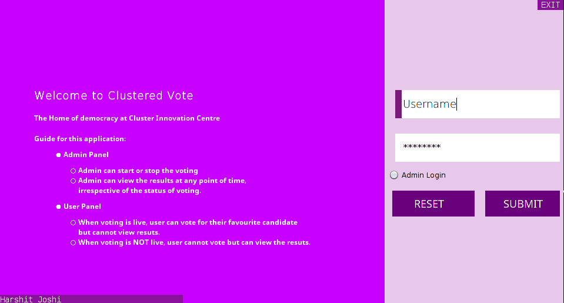
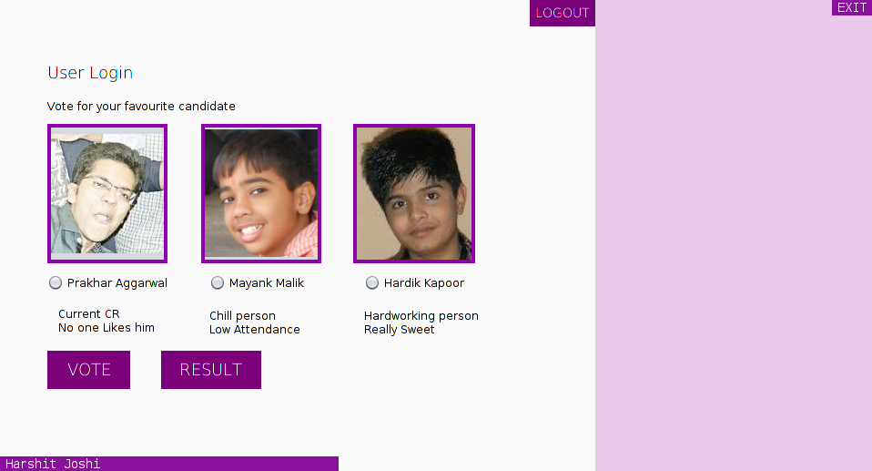

# VoterSystem
Java project for OOPs Course second semester.

## Testing
```
$ git clone https://github.com/duksybomb/VoterSystem.git
$ cd VoterSystem/jar
$ java -jar VotinGUI.jar
```

## Screen Shots
### Login Panel
 
### Voting Panel
 